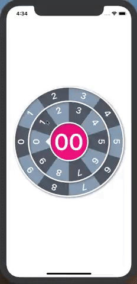

# DCWheelPickerView

[](http://opensource.org/licenses/MIT)

`DCWheelPickerView` is a number picker that can pick number from 0 to 99. It supported dragging and tapping, you can interact the outer wheel or inner wheel with gesture.



## Adding DCWheelPickerView to your project

### Source files

directly add DCWheelPickerView folder to your project


## Usage

```swift
let wheelPicker = DCWheelPickerView(frame: containerView.bounds)
containerView.addSubview(wheelPicker)

wheelPicker.didSelectIndexCompletion = { (index) in
  print("DidSelectIndex: \(index)")
}
wheelPicker.didTapCenterCompletion = {
  print("DidTapCenter")
}
```


## License

This code is distributed under the terms and conditions of the [MIT license](https://github.com/DeanChung13/DCWheelPickerView/blob/master/LICENSE).